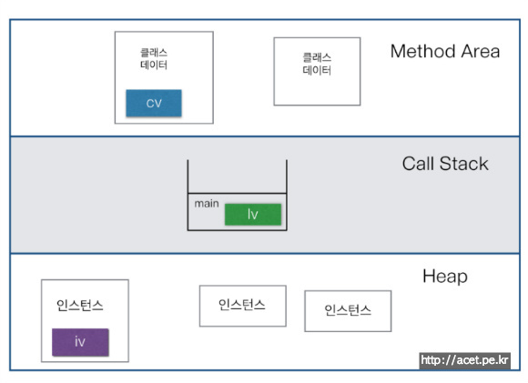

# Ch6 객체 지향 프로그래밍 1

- 실제 발생하는 모든 사건들은 사물과 사물간의 상호작용이다라는 개념으로 실제 사물의 속성과 기능을 분석 후 데이터와 함수로 정의함으로써 프로그램을 구현함
- 상속, 캡슐화, 추상화
- 객체 지향의 장점
  - 코드의 재사용성이 높음
  - 코드의 관리가 용이함
  - 신뢰성이 높은 프로그래밍 가능

## 클래스와 객체

### 객체지향적 정의
- 클래스: 객체를 정의해 놓은 것, 객체를 생성하기 위한 틀 (인스턴스화)
- 객체: 실제로 존재하는 것, 속성과 기능으로 정의되어있다 (클래스의 인스턴스)
  - 속성: 멤버 변수
  - 기능: 메서드

### 인스턴스 생성과 사용
클래스명 변수명; &nbsp;&nbsp; 클래스의 객체를 참조하기 위한 참조변수 선언   
변수명 = new 클래스명(); &nbsp;&nbsp; 클래스 객체 생성 후 객체의 주소를 참조변수에 저장
```java
class Tv {
    String color;
    boolean power;
    int channel;

    void power() {power = !power;}
    void channelUp() {++channel;}
    void channelDown() {--channel;}
}

public class TvTest {
    public static void main(String[] args) {
        Tv t;
        t = new Tv();
        t.channel = 7;
        t.channelDown();
        System.out.println("현재 채널: " + t.channel);
    }
}
```
- 참조변수를 생성하고 new로 인스턴스를 생성해 참조변수에 저장해야함
- 인스턴스는 참조변수를 통해서만 다룰 수 있음

```java
class Tv3 {
    String color;
    boolean power;
    int channel;

    void power() {power = !power;}
    void channelUp() {++channel;}
    void channelDown() {--channel;}
}

public class Tvtest3 {
    public static void main(String[] args) {
        Tv3 t3 = new Tv3();
        Tv3 t4 = new Tv3();
        t3.channel = 7;
        System.out.println("t3 현재 채널: " + t3.channel);
        System.out.println("t4 현재 채널: " + t4.channel);
        t4 = t3;  // 참조변수 t4에 t3 저장, t4가 t3가 가리키는 인스턴스를 가리키게 됨
        System.out.println("t3 현재 채널: " + t3.channel);
        System.out.println("t4 현재 채널: " + t4.channel);
    }
}
```
- t4 = t3 로 t4가 t3가 가리키는 인스턴스를 가리키게 됨
- t4가 가리키던 객체는 JVM의 가비지 컬렉터에 의해 자동으로 메모리에서 제거됨

### 객체 배열
객체는 참조변수로 접근하므로 참조 배열을 사용하면 객체 배열을 사용할 수 있음  
```java
Tv[] tvArr = new Tv[3];
```
이건 객체를 다루기 위한 참조 변수들만 만들어진 것이므로 아직 객체가 생성된 것은 아님  
다음과 같이 초기화 해줘야 함
```java
Tv[] tvArr = new Tv[3];
tvArr[0] = new Tv();
tvArr[1] = new Tv();
tvArr[2] = new Tv();
```
```java
Tv[] tvArr = {new Tv(), new Tv(), new Tv()};
```
```java
Tv[] tvArr = new Tv[100];
for (int i = 0; i < tvArr.length; i++)
    tvArr[i] = new Tv();
```
### 클래스의 프로그래밍적 정의
1. 변수: 하나의 데이터를 저장할 수 있는 공간
2. 배열: 같은 종류의 여러 데이터를 하나의 집합으로 저장할 수 있는 공간
3. 구조체: 서로 관련된 여러 데이터를 종류에 관계없이 하나의 집합으로 저장할 수 있는 공간
4. **클래스: 데이터와 함수의 결합 (구조체 + 함수)**
   - 클래스는 데이터와 함수의 결합으로 이루어져있고 변수와 함수가 서로 유기적으로 연결되어 작업이 간단하고 명료해짐

- 클래스는 사용자 정의 타입이다
  - 기본 자료형에서 더 나아가 사용자가 서로 관련된 변수들을 묶거나 조건을 추가해 새로 정의할 수 있다
  - 예를 들어 시간의 경우 시, 분, 초 를 각각 변수를 선언하지 않고 하나의 클래스로 정의해 손 쉽게 다룰 수 있다

## 변수와 메서드
### 변수의 종류
- 지역 변수: 클래스 영역 이외의 영역, 멤버 함수 내부 포함
- 멤버 변수: 클래스 영역
  - 클래스 변수: static, 클래스가 메모리에 생성될 때 생성, 모든 인스턴스가 같은 저장공간을 공유함
    - 인스턴스 변수와 헷갈리는 걸 방지하기 위해 클래스.변수 식으로 사용함
  - 인스턴스 변수: 인스턴스가 생성될 때 생성, 인스턴스마다 각각의 저장공간 가짐

### 메서드
기본적으로 C++의 함수와 똑같지만 멤버함수로서 많이 쓰임

### JVM의 메모리 구조

- 메서드 영역: 클래스에 대한 정보 저장, 클래스 변수 포함
- 호출 스택: 함수 스택, 지역변수 매개변수 포함
- 힙: 인스턴스가 생성되는 공간

### 참조형 매개변수, 참조형 반환타입
call by reference
- 배열이나 구조체, 인스턴스를 매개변수로 가짐
- 주소를 전달 받아 접근하므로 값을 변경 가능  

참조형 반환 타입
- Data copy (Data d);
- 메서드가 Data 객체의 주소를 반환함


