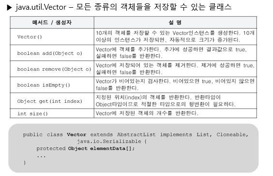

# Ch7 객체 지향 프로그래밍 2

## 다형성
한 타입의 참조변수로 여러 타입의 객체를 참조할 수 있음  
조상 클래스 타입의 참조변수로 자손 클래스의 인스턴스를 참조할 수 있음
- 단, 조상 클래스 타입의 참조변수로 자손 클래스의 인스턴스를 참조한 경우 조상 클래스에도 속해있는 멤버들에만 접근이 가능함
- 참조변수가 사용할 수 있는 멤버의 개수는 인스턴스의 멤버 개수보다 같거나 작아야 함
- ***자손타입의 참조변수로 조상타입의 인스턴스를 참조하는 것은 불가능함***
  - 인스턴스의 실제 타입을 아는것이 중요함
```java
Tv t = new Tv();
Tv t2 = new CaptionTv();    // Tv는 CaptionTv의 조상
```

### 참조변수의 형변환
서로 상속 관계에 있는 클래스들 사이에서 참조변수의 형변환이 가능함
- 자손타입 -> 조상타입 (Up-casting) : 형변환 생략가능
- 조상타입 -> 자손타입 (Down-casting) : 형변환 생략불가
  - 멤버의 개수가 늘어날 가능성이 있어 문제가 발생할 수 있으므로 명시해줘야함

***형변환은 참조변수의 타입을 변환하는 것 뿐 인스턴스에는 아무 영향을 미치지 않음 단지 인스턴스에서 사용가능한 멤버의 개수를 조절하는 것***

다형성의 예시도 다음의 코드에서 형변환 연산이 생략된 것임
```java
CaptionTv c = new CaptionTv();
Tv t2 = (Tv) c; // 형변환 생략
// Tv t2 = (Tv) new CaptionTv();
```
첫줄에서 CaptionTv의 인스턴스가 생성되고 CaptionTv형 참조변수 c에 저장 됐다가 이가 Tv형으로 참조변수 형변환이 이뤄지고 t2에 저장, 이로인해 인스턴스의 사용 가능한 멤버 개수가 조정됨
- c로 인스턴스에 접근할 경우 : CaptionTv의 모든 멤버에 접근 가능
- t2로 인스턴스에 접근할 경우 : Tv의 멤버에만 접근 가능

### instanceof 연산자
참조변수가 참조하고 있는 인스턴스의 실제 타입을 알 수 있는 연산자  
```java
참조변수 instanceof 타입(클래스명)
```
- 왼쪽의 참조변수가 오른쪽의 타입으로 형 변환이 가능하다면 true, 가능하지 않다면 false

### 참조변수와 인스턴스의 연결
조상 클래스에 선언된 멤버변수와 자손의 인스턴스변수의 이름이 중복 되었을 때
- 조상 타입의 참조변수 -> 조상 클래스의 멤버변수
- 자손 타입의 참조변수 -> 자손 클래스의 멤버변수  

인스턴스 메서드의 경우에는 중복되면 오버라이딩이 되기 때문에 참조 타입과 상관없이 실제 인스턴스의 메서드가 호출 됨 

static 변수와 메서드는 참조 타입에 영향을 받으므로 static 멤버는 참조변수가 아니라 클래스 이름으로 호출하는 것이 바람직함

### 매개변수의 다형성
```java
class Product {
    int price;
    int bonusPoint;

    Product(int price) {
        this.price = price;
        bonusPoint = (int)(price/10.0);
    }
}

class Tv2 extends Product {
    Tv2() {
        super(100);
    }
    public String toString() {return "Tv";}
}

class Computer extends Product {
    Computer() {
        super(200);
    }
    public String toString() {return "Computer";}
}

class Buyer {
    int money = 1000;
    int bonusPoint = 0;

    void buy(Product p) {   // 매개변수 다형성
        if(money < p.price) {
            System.out.println("잔액이 부족합니다.");
            return;
        }

        money -= p.price;
        bonusPoint += p.bonusPoint;
        System.out.println(p + "을/를 구입하였습니다.");
    }
}

public class PolyArgumentTest {
    public static void main(String[] args) {
        Buyer b = new Buyer();

        b.buy(new Tv2());
        b.buy(new Computer());

        System.out.println("현재 잔액은 " + b.money + "만원입니다.");
        System.out.println("현재 포인트는 " + b.bonusPoint + "포인트입니다.");
    }
}
```
- 위 코드에서 Buyer의 buy 메서드의 매개변수에서 매개변수의 다형성을 이용함
- Tv, Computer 등 따로따로 메서드를 오버로딩 해야할 수도 있던걸 그들의 조상형인 Product형 참조변수로 설정해 조상타입 참조변수가 자손타입 인스턴스를 참조하게 만들어 하나의 메서드로 해결함

### 여러 종류의 객체를 배열로 다루기
조상타입의 참조 배열을 생성해 각기 다른 자손 인스턴스들을 저장할 수 있음  
- Vector 클래스는 이러한 배열을 가지고 있으면서 크기를 알아서 관리해줌

<details>
<summary>예제</summary>
<div>

```java
import java.util.*;

class Product {
    int price;
    int bonusPoint;

    Product(int price) {
        this.price = price;
        bonusPoint = (int)(price/10.0);
    }

    Product() {
        price = 0;
        bonusPoint = 0;
    }
}

class Tv2 extends Product {
    Tv2() {
        super(100);
    }
    public String toString() {return "Tv";}
}

class Computer extends Product {
    Computer() {
        super(200);
    }
    public String toString() {return "Computer";}
}

class Audio extends Product {
    Audio() {
        super(50);
    }
    public String toString() {return "Audio";}
}

class Buyer {
    int money = 1000;
    int bonusPoint = 0;
    Vector item = new Vector();


    void buy(Product p) {   // 매개변수 다형성
        if(money < p.price) {
            System.out.println("잔액이 부족합니다.");
            return;
        }

        money -= p.price;
        bonusPoint += p.bonusPoint;
        item.add(p);
        System.out.println(p + "을/를 구입하였습니다.");
    }

    void refund(Product p) {
        if(item.remove(p)) {
            money += p.price;
            bonusPoint -= p.bonusPoint;
            System.out.println(p + "을/를 반품하였습니다.");
        }
        else
            System.out.println("구입 목록중 해당 제품이 없습니다.");
    }

    void summary() {
        int sum = 0;
        String itemList = "";

        if(item.isEmpty()) {
            System.out.println("구입하신 제품이 없습니다.");
            return;
        }

        for(int i = 0; i<item.size(); i++) {    // item.length 아님 주의
            Product p = (Product) item.get(i);  // Object get(int index) 이므로 적절한 형변환 필요
            sum += p.price;
            itemList += (i==0) ? "" + p : ", " + p; // 출력형식 조건 연산자로 한줄로 처리
        }

        System.out.println("구입하신 물품의 총금액은 " + sum + "만원입니다.");
        System.out.println("구입하신 제품은 " + itemList + "입니다.");
    }
}

public class PolyArgumentTest3 {
    public static void main(String[] args) {
        Buyer b = new Buyer();
        Tv2 tv = new Tv2();
        Computer com = new Computer();
        Audio audio = new Audio();

        b.buy(tv);
        b.buy(com);
        b.buy(audio);
        b.summary();
        System.out.println();
        b.refund(com);
        b.summary();
    }
}
```

</div>
</details>

- Vector 클래스를 통해 인스턴스 배열을 생성하고 Vector 클래스의 메서드들 이용


## 추상 클래스
추상 메서드를 가진 클래스 (나머지 멤버는 상관 없음)
```java
abstract class 클래스이름 {
    ...
}
```
- 추상 메서드를 가졌기 때문에 자손 클래스에서 완성 되어야함

### 추상 메서드
```java
abstract 리턴타입 메서드이름(매개변수); // 주석으로 기능 설명
```
- 정의만 작성해 두고 구현은 자손 클래스에서 작성
- 구현부가 없으므로 괄호{} 대신 ; 사용
- 완성되지 않은 추상 메서드가 하나라도 있으면 자손 클래스도 추상 클래스로 선언 되어야함

### 추상 클래스의 작성
- 클래스들에서 공통적인 부분들을 뽑아 조상 클래스를 만들지 고려한다
- 공통적인 부분중에 각 자손이 공통적으로 가지고 있는 기능이지만 구현이 다른 경우에 추상 메서드로 정의하여 각 자손에서 구현하도록 한다

## 인터페이스
오로지 추상 메서드와 상수만을 가질 수 있는 추상 클래스  
추상화 정도가 추상 클래스 보다 높고 다른 클래스를 작성하는데 도움을 줄 목적으로 사용  
(인터페이스는 다른 클래스와 달리 Object와 같은 최종 조상이 없음)

### 인터페이스의 작성
```java
interface 인터페이스이름 {
    public static final 타입 상수이름 = 값;
    public static 반환타입 메서드이름(매개변수);
}
```
- 모든 멤버변수는 public static final 이어야 하고 생략 가능
- 모든 메서드는 public abstract 이어야 하고 생략 가능
  - 단, static 메서드와 default(접근 제어 아님) 메서드는 예외

### 인터페이스의 상속
인터페이스는 인터페이스로부터만 상속 받을 수 있고 다중 상속이 가능함  
instanceof 연산자도 사용 가능함

### 인터페이스의 구현
```java
class 클래스이름 implements 인터페이스이름 {
    // 추상 메서드 구현
}
```
- 구현되지 않은 추상 메서드가 있다면 abstract를 붙여 추상 클래스로 선언 해야함
- 메서드 오버라이딩 시에는 조상의 메서드보다 넓은 접근 제어자를 지정해야 하는데 인터페이스의 추상 메서드에 아무 접근 제어자가 없다면 public abstract 이므로 구현할 때 public으로 지정해줘야함
```java
class 클래스이름 extends 상속 implements 인터페이스 {
    // ...
}
```
- 상속과 인터페이스 구현 동시에 가능

### 인터페이스를 이용한 다중 상속
(이런것도 된다 정도지 실제로 거의 안쓰긴 함)
- 하나는 is a로  상속 받고 하나는 has a 로 포함하는 경우 has a의 메서드를 사용하려 할 때
- has a 로 포함한 클래스의 메서드를 인터페이스를 작성해 implements로 자손 클래스에 구현
- 이 때 구현 내용은 has a 로 포함한 인스턴스의 메서드 호출

### 인터페이스를 이용한 다형성
```java
class Unit implements IUnit {}

IUnit u = (IUnit)new Unit();
```
인터페이스도 이를 구현한 클래스에겐 조상이기 때문에 참조변수로 이를 구현한 클래스의 인스턴스를 참조할 수 있음  

```java
IUnit method() {    // 인터페이스 반환 타입
    return new Unit;    // 구현 클래스 인스턴스
}
```
***리턴타입이 인터페이스인 경우에 해당 인터페이스를 구현한 클래스의 인스턴스를 반환함***

### 인터페이스의 장점

- 메서드를 사용하는 입장에선 선언부만 알면 되고 메서드를 구현 하는 사람은 동시에 따로 구현할 수 있기 때문에 개발 시간이 단축됨
- 클래스의 구현이 분리 되어있으므로 같은 인터페이스를 공유하더라도 간접적인 관계이기 때문에 한 클래스의 변경이 다른 클래스에 영향을 미치지 않음
- 표준화되고 일관된 개발 가능
  - 서로 다른 데이터베이스를 이용한 작업일 경우 java application 에서 만든 JDBC 라는 인터페이스들로 이루어진 표준 DB가 있기 때문에 이를 바탕으로 구현한 DB의 경우 전환에 무리가 없음
- 클래스들에 새로운 관계를 만들어 줄 수 있음
  - 인터페이스를 정의하고 관계를 설정하고싶은 클래스들이 이를 구현하게 해 그 클래스들 끼리 엮어줄 수 있음
  - 인터페이스를 정의하고 구현하면서 이를 구현한 클래스를 has a 로 포함하게 해 코드의 중복을 없애 나중에 변경 (유지,보수)이 편하게 할 수 있음

### 인터페이스의 이해

클래스를 사용하는 쪽(User)과 클래스를 제공하는 쪽(Provider)이 있다면  
메서들를 사용하는 쪽(User)에서는 사용하려는 메서드의 선언부(Provider)만 알면 된다

```java
class InterfaceTest3 {
    public static void main(String[] args) {
        A a = new A();
        a.methodA();
    }
}

class A {
    void methodA() {
        I i = InstanceManager.getInstance();    //인스턴스를 직접 생성하지 않고 메서드를 통해 제공받음
        i.methodB();
        System.out.println(i.toString());   // i로 Object 메서드 호출 가능
    }
}

interface I {
    public static void methodB();
}

class B implements I {
    public void methodB() {
        System.out.println("method in B class");
    }

    public String toString() { return "class B"; }
}

class InstanceManager {
    public static I getInstance() {
        return new B();     // 다른 클래스의 인스턴스로 변경하려면 여기만 변경하면 됨
    }
}
```
- A 입장에선 어떤 클래스의 메서드를 사용하더라도 methdA()만 호출하면 되고 메서드의 내용을 변경해도 A 입장에선 수정할 것이 없음

### 디폴트 메서드
```java
interface Myinterface {
    void method();
    default void newMethod() {}
}
```
- 이미 구현된 인터페이스에 메서드를 추가할 때 default 메서드로 추가하면 이를 일일이 구현하지 않아도 {} 안의 내용으로 구현됨
- 필요한 경우에만 그 클래스에서 오버라이딩 해주면 됨
- 이름이 중복되어 충돌하는 경우 오버라이딩 된 메서드가 호출 되거나 조상 클래스의 메서드가 상속됨