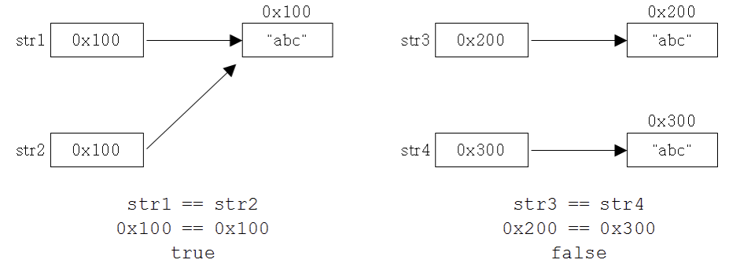

# Ch9 java.lang 패키지와 유용한 클래스

## 1. java.lang 패키지
import문 없이도 사용할 수 있는 자바의 기본 클래스들

## 1.1 Object 클래스
모든 클래스의 최고 조상  
멤버 변수는 없고 11개의 메서드만 가지고 있음


### equals(Object obj)
매개변수로 객체의 참조변수를 받아서 비교하고 결과를 boolean 값으로 반환함
```java
public boolean equals(Object obj) {
    retun (this == obj);
}
```
위에서 보듯이 equals는 단순히 주소값으로 비교를 하기 때문에 인스턴스간의 멤버를 비교하려면 오버라이딩이 필요하다

```java
class Person {
    long id;

    public boolean equals (Object obj) {
        if(obj != null && obj instanceof Person)
            return id == ((Person)obj).id;  // 매개변수가 Object 타입이므로 id값에 접근하기 위해선 Person 타입으로 형변환 해줘야함
        else    
            return false;   // Person 타입이 아니라면 비교할 필요도 없음
    }
}
```
String, Date, File, wrapper 클래스의 equals메서드도 위와 같이 주소값이 아닌 멤버를 비교하도록 오버라이딩 되어있음

### hashCode()

- 해시함수(해시) : 임의의 길이를 가진 임의의 데이터를 고정된 길이를 가진 데이터로 매핑하는 함수 (나머지 등)
- hashing(자료구조) : 어떤 항목의 키를 해시함수를 이용하여 해당 항목의 값(인덱스, 해시코드)을 얻어 해시 테이블(배열)에 접근하는 것
- hashCode()는 java에서 이 해시함수를 구현한 것
- 64 bit JVM 부터는 해시코드가 중복된 객체들이 존재할 수 있음
- 클래스의 인스턴스변수 값으로 객체의 같고 다름을 판단하는 경우엔 해시코드도 비교해야 하기 때문에 equals 뿐 아니라 hashCode도 적절히 오버라이딩 해야함
```java
class HashCodeEx1 {
    public static void main(String[] args) {
        String str1 = new String("abc");
        String str2 = new String("abc");

        System.out.println(str1.equals(str2));
        System.out.println(str1.hashcode());    // 문자열의 내용이 같으면 동일한 해시코드가 나오도록 오버라이딩
        System.out.println(str2.hashcode());    // str1과 같은 값
        System.out.println(System.identityHashcode(str1));  // 객체의 주소값으로 해시코드 생성, 객체마다 다름
        System.out.println(System.identityHashcode(str2));  // str1과 다른 값
    }    
}
```
- 위에서 보듯이 String 클래스에서는 hashCode()가 문자열의 내용이 같으면 같은 해시코드를 반환하도록 오버라이딩 되어있음
- System.identityHashcode()나 Object.hashCode()는 객체의 주소값에 따라 해시코드를 반환하기 때문에 객체마다 다른 해시코드가 나옴
- 위 코드의 결과에 따르면 str1과 str2는 해시코드는 같지만 서로 다른 객체라는 것을 알 수 있음

### toString()
인스턴스에 대한 정보(인스턴스 변수에 저장된 값)를 문자열로 제공
```java
public String toString() {
    return getClass().getName() + "@" + Integer.toHexString(hashCode());
}
```
- 오버라이딩 하지 않으면 위와 같이 클래스의 이름과 16진수의 해시코드를 반환함  
- String이나 Date등의 클래스에선 문자열이나 날짜와 시간등을 문자열로 반환하도록 오버라이딩되어 있음
- 오버라이딩할 때에는 Object의 toString()이 public이기 때문에 오버라이딩할 때도 public으로 해주어야함

### clone()
자신을 복제하여 새로운 인스턴스를 생성함  
이 때 기본적으로는 얕은 복사가 일어나기 때문에 배열같은 참조타입의 인스턴스 멤버는 주소값만 복사되어 원본과 겹치게 된다
```java
public class Object {
    protected native Object clone() throws CloneNotSupportedException;
}
```
```java
class Point implements Cloneable {  // Cloneable인터페이스를 구현한 클래스에서만 clone()을 호출할 수 있음. 아니면 예외 발생
    int x, y;

    Point(int x, int y) { 
        this.x = x;
        this.y = y;
    }

    public String toString() {
        return "x=" + x + ", y=" + y;
    }

    public Object clone() { // 접근 제어자 public으로 변경
        Object obj = null;
        try {   // clone()은 반드시 예외처리를 해줘야함
            obj = super.clone();    // 조상 클래스(Object)의 clone 호출
        } catch (CloneNotSupportedException e) {}
        return obj;
    }
}

class CloneEx1 {
    public static void main(String[] args) {
        Point original = new Point(3, 5);
        Point copy = (Point)original.clone();   // 반환이 Object 인스턴스이기 때문에 Point로 형변환
        System.out.println(original);
        System.out.println(copy);
    }
}
```
- clone()은 Cloneable 인터페이스가 구현된 클래스의 인스턴스에서만 사용 가능함
- clone()은 접근 제어자가 protected이기 때문에 public으로 변경해야만 상속 관계가 아닌 클래스에서도 쓸 수 있음
- clone() 에외처리가 필수이기 때문에 try-catch 사용해서 구현해야함

### 공변 반환 타입
오버라이딩 시에 조상 메서드의 반환 타입을 자손 클래스의 반환 타입으로 변경을 허용함  
위 코드의 public Object clone()이 다음과 같이 변경될 수 있음
```java
pubic Point clone() {
    Object obj = null;
    try {
        obj = super.clone();
    } catch (CloneNotSupportedException e) {}
    return (Point) obj;
}

...

Point copy = original.clone();  // 형변환 안해도 됨
```

### 배열과 clone()
*배열도 객체이기 때문에 Object 클래스를 상속 받고 Cloneable과 Serializable인터페이스가 구현되어 있다*
```java
int[] arr = {1,2,3,4,5};
int[] arrClone = new int[arr.length];
System.arraycopy(arr, 0, arrClone, 0, arr.length);
```
이렇게 복사하던 걸
```java
int[] arr = {1,2,3,4,5};
int[] arrClone = arr.clone();
```
이렇게 가능하다

### 얕은 복사와 깊은 복사
clone()은 단순히 객체에 저장된 값을 그대로 복제하므로 참조하고 있는 객체까지 복제하지 않는다 (주소만 단순 복제), 이러면 원본과 복제본이 같은 객체를 공유하므로 서로 영향을 줘버린다
- 오버라이딩할 때 이를 고려하여 깊은 복제가 이뤄지도록 해야한다
```java
class Circle implements Cloneable {
    Point p;    // x, y 좌표 객체
    double r;

    Circle(Point p, double r) {
        this.p = p;
        this.r = r;
    }

    public Circle deepClone() {
        Object obj = null;
    
    try {
        obj = super.clone();
    }
    catch (CloneNotSupportedException e) {}
    Circle c = (Circle) obj;
    c.p = new Point(this.p.x, this.p.y);    // 복체한 인스턴스의 Point 객체를 따로 생성해줌

    return c;
    }
}
```

### getClass()
자신이 속한 클래스의 Class 객체를 반환함 (이름이 Class인 클래스의 객체임)
```java
public final class Class implements .. {    // Class 클래스

}
```
- Class객체는 클래스의 모든 정보를 담고있고 클래스당 하나만 존재함
- 클래스 파일이 클래스 로더에 의해서 메모리에 올라갈 때 자동으로 생성됨
- 기존에 생성된 클래스 객체가 메모리에 이미 있으면 객체의 참조를 반환하고 없으면 클래스 패스에 지정된 경로를 따라서 클래스 파일을 찾음
- 못 찾으면 예외가 발생하고 찾으면 해당 클래스 파일을 읽어서 Class 객체로 변환

### Class객체를 얻는 방법
```java
Class cObj = new Card().getClass(); // 생성된 객체로 부터
Class cObj = Card.class;            // 클래스 리터럴(*.class)로 부터
Class cObj = Class.forName("Card"); // 클래스 이름으로 부터 // DB 드라이버같은 특정 클래스 파일을 메모리에 올릴 때 많이 사용
```
Class객체를 이용하면 클래스에 대한 모든 정보를 얻을 수 있기 때문에 Class 객체를 통해서 객체를 생성하고 메서드를 호출하는 등 보다 동적인 코드를 작성할 수 있음 (리플렉션 API, Class클래스 API 참고)

## 1.2 String 클래스
문자열을 저장하고 이를 다루는데 필요한 메서드 제공

### 변경 불가능한 클래스
```java
public final class String implements java.io.Serializable, Comparable {
    private char[] value;
    ...
```
- 위와 같이 String 클래스에서는 문자열을 저장하기 위해 문자형 배열을 인스턴스 변수로 가지고있고 생성자의 매개변수로 초기화함
- 한번 생성된 문자열은 읽을 수만 있고 변경할 수는 없음
  - (+) 연산자를 이용하는 경우(a+b) 인스턴스 내의 문자열이 변경되는 것이 아니라 새로운 문자열이 담긴 String인스턴스가 생성됨 (ab)
- 이는 많이 사용하면 메모리에 부담이 가기 때문에 변경 가능한 StringBuffer 클래스도 있음

### 문자열의 비교
문자열을 만드는 데에는 두 가지 방법이 있음
- 문자열 리터럴 : String st1 = "abc";
  - 메모리상에 이미 존재하는 문자열 "abc"를 str1이 재사용하는 것
- String 인스턴스 생성 : String str2 = new String("abc");
  - new 연산자에 의해 항상 새로운 메모리 할당이 일어남




이는 문자열의 내용을 비교하는 equals()와 String인스턴스의 주소를 == 연산자로 비교했을 때 다른 결과를 보여준다

### 문자열 리터럴
- 소스파일에 포함된 모든 문자열 리터럴은 컴파일 시에 클래스 파일에 저장됨 
- 이 때 같은 내용의 문자열 리터럴은 한번만 저장됨  
- 문자열 리터럴도 String인스턴스이고 어짜피 변경이 불가능하므로 하나의 인스턴스를 공유하면 되기 때문
- 클래스 파일이 클래스 로더에 의해 메모리에 올라갈 때 리터럴 목록에 있던 리터럴들은 JVM의 상수 저장소에 저장됨, 이 때 문자열 리터럴이 자동적으로 생성되어 저장됨
```java
String s1 = "AAA";
String s2 = "AAA";
String s3 = "AAA";
```
이렇게 되면 "AAA"를 담고있는 String인스턴스가 하나 생성된 후 참조변수 s1, s2, s3 모두 이 인스턴스를 참조하게 된다

### 빈 문자열
java에서는 길이가 0인 배열이 존재할 수 있기 때문에 빈 문자열도 존재함
- java에서는 문자열 끝에 \0 널 문자가 붙지 않고 문자열의 길이 정보를 따로 저장하기 때문에 길이가 0인 배열이 될 수 있음

### String 클래스의 생성자와 메서드
<details>
<summary>1. 생성</summary>
<div>

|메서드/설명|예제|결과|
|------|---|---|
|String(String s) <br> 주어진 문자열(s)를 갖는 String인스턴스 생성|String s = new String("Hello");|s = "Hello"|
|String(char[] value) <br> 주어진 문자열(value)을 갖는 String인스턴스 생성|char[] c = {'H', 'e', 'l', 'l', 'o'}; <br> String s = new String(c)|s = "Hello"|
|String(StringBuffer buf) <br> StringBuffer 인스턴스가 갖고있는 문자열과 같은 내용의 tring인스턴스 생성|StringBuffer sb = new StringBuffer("Hello"); <br> String s = new String(sb);|s = "Hello"|

</div>
</details>

<details>
<summary>2. 비교/검사</summary>
<div>

|메서드/설명|예제|결과|
|------|---|---|
|int CompareTo(String str) <br> 문자열(str)과 사전순서로 비교 <br> 같으면 0, 이전이면 음수, 이후면 양수|int i = "aaa".compareTo("aaa"); <br> int i2 = "aaa".compareTo("bbb"); <br> int i3 = "bbb:.compareTo("aaa");|i = 0 <br> i2 = -1 <br> i3 = 1|
|boolean contains(CharSequence s) <br> 지정된 문자열(s)의 포함 여부 검사|String s = "abcdef"; <br> boolean b = s.contains("bc");|b = true|
|boolean endsWith(String suffix) <br> 지정된 문자열(suffix)로 끝나는지 검사|String file = "Hello.txt"; <br> boolean b = file.endsWith(".txt");|b = true|
|boolean startsWith(String prefix) <br> 지정된 문자열(prefix)로 시작하는지 검사|String s = "java.lang.Object"; <br> boolean b1 = s.startsWith("java"); <br> boolean b2 = s.startsWith("lang");|b1 = true <br> b2 = false|
|boolean equals(Object obj) <br> 매개변수로 입력받은 문자열(obj)와 String 인스턴스의 문자열 비교|String s = "Hello"; boolean b = s.equals("Hello"); <br> boolean b2 = s.equals("hello");|b = true <br> b2 = false|
|boolean equalsIgnoreCase(String str) <br> 문자열과 String 인스턴스의 문자열 대소문자 구분없이 비교|String s = "Hello"; boolean b = s.equalsIgnoreCase("Hello"); <br> boolean b2 = s.equalsIgnoreCase("heLLo");|b = true <br> b2 = true|
</div>
</details>

<details>
<summary>3. 조회</summary>
<div>

|메서드/설명|예제|결과|
|------|---|---|
|char charAt(int index) <br> 지정된 위치(index)에 있는 문자를 반환 (0부터 시작)|String s = "Hello"; <br> String n = "0123456"; <br> char c = s.charAt(1); <br> char c2 = n.charAt(1);|c = 'e' <br> c2 = '1'|
|int indexOf(int ch) <br> 주어진 문자(ch)가 문자열에 존재하는지 확인하고 그 위치를 반환 <br> (없으면 -1 반환)|String s = "Hello"; <br> int idx1 = s.indexOf('o') <br> int idx2 = s.indexOf('k');|idx1 = 4 <br> idx2 = -1|
|int indexOf(int ch, int pos) <br> 주어진 문자(ch)가 문자열에 존재하는지 지정된 위치부터(pos)확인하고 그 위치를 반환 <br> (없으면 -1 반환)|String s = "Hello"; <br> int idx1 = s.indexOf('e', 1) <br> int idx2 = s.indexOf('e', 2);|idx1 = 0 <br> idx2 = -1|
|int indexOf(String str) <br> 주어진 문자열이(str) 문자열에 존재하는지 확인하고 그 위치를 반환 <br> (없으면 -1 반환)|String s = "ABCDEF"; <br> int idx = s.indexOf("CD");|idx = 2|
|int lastIndexOf(int ch) <br> 주어진 문자(ch) 문자열에 존재하는지 뒤에서부터 확인하고 그 위치를 반환 <br> (없으면 -1 반환)|String s = "java.lang.java"; <br> int idx1 = s.lastIndexOf('.') <br> int idx2 = s.indexOf('.');|idx1 = 9 <br> idx2 = 4|
|int lastIndexOf(String str) <br> 주어진 문자열이(str) 문자열에 존재하는지 뒤에서부터 확인하고 그 위치를 반환 <br> (없으면 -1 반환)|String s = "java.lang.java"; <br> int idx1 = s.lastIndexOf("java") <br> int idx2 = s.indexOf("java");|idx1 = 10 <br> idx2 = 0|
|String intern() <br> 문자열을 상수 저장소(constant pool)에 저장하고 상수 저장소에 같은 문자열이 이미 있으면 주소값 반환 <br> (없으면 -1 반환)|String s1 = new String("abc"); <br> String s2 = new String("abc"); <br> boolean b1 = (s1 == s2); <br> boolean b2 = s1.equals(s2); <br> boolean b3 = (s1.intern() == s2.intern());|b1 = false <br> b2 = true <br> b3 = true|
|int length() <br> 문자열 길이 반환|String s = "Hello"; <br> int length = s.length();|length = 5;|

</div>
</details>

<details>
<summary>4. 편집</summary>
<div>

|메서드/설명|예제|결과|
|------|---|---|
|String concat(String str) <br> 문자열(str)을 뒤에 덧붙임|String s = "Hello"; <br> String s2 = s.concat("World");|s2 = "HelloWorld"|
|String replace(char old, char nw) <br> 문자열 중의 문자(old)를 새로운 문자(nw)로 바꾼 문자열을 반환|String s = "Hello"; <br> String s1 = s.replace('H','C');|s2 = "Cello"|
|String replace(CharSequence old, CharSequence nw) <br> 문자열 중의 문자열(old)를 새로운 문자열(nw)로 바꾼 문자열을 반환|String s = "Hellollo"; <br> String s1 = s.replace('ll','LL');|s2 = "HeLLoLLo"|
|String replaceAll(String regex, String replacement) <br> 문자열 중에서 문자열(regex)와 일치하는 것을 모두 문자열(replacement)로 변경|String ab = "AABBAABB"; <br> String r = ab.replaceAll('BB','bb');|r = "AAbbAAbb"|
|String replaceFirst(String regex, String replacement) <br> 문자열 중에서 문자열(regex)와 일치하는 것 중, 첫 번째 것만 문자열(replacement)로 변경|String ab = "AABBAABB"; <br> String r = ab.replaceAll('BB','bb');|r = "AAbbAABB"|
|String[] split(String regex) <br> 문자열을 지정된 분리자(regex)로 나누어 문자열 배열에 나눠 반환|String animals = "dog,cat,bear"; <br> String[] arr = animals.split(",");|arr[0] = "dog" <br> arr[1] = "cat" <br> arr[2] = "bear"|
|String[] split(String regex, int limit) <br> 문자열을 지정된 분리자(regex)로 나누어 문자열 배열에 나눠 반환. 단, 문자열 전체를 지정된 수(limit)로 자름|String animals = "dog,cat,bear"; <br> String[] arr = animals.split(",", 2);|arr[0] = "dog" <br> arr[1] = "cat,bear"|
|String substring(int begin) <br> String substring(int begin, int end) <br> 시작 위치(begin)부터 끝 위치(end) 범위에 포함된 문자열을 반환 [begin,end)|String s = "java.lang.Object"; <br> String c = s.substring(10); <br> String p = s.substring(5, 9);|c = "Object" <br> p = "lang"|
|String trim() <br> 문자열의 왼쪽 끝과 오른쪽 끝에 있는 공백을 없앤 결과를 반환 (중간에 있는 공백은 제거 안됨)|String s = "  Hello World  "; <br> String s1 = s.trim();|s1 = "Hello World"|

</div>
</details>

<details>
<summary>5. 변환</summary>
<div>

|메서드/설명|예제|결과|
|------|---|---|
|String toString() <br> String인스턴스에 저장되어있는 문자열을 반환|String s = "Hello"; <br> String s1 = s.toString();|s1 = "Hello"|
|String toLowerCase() <br> String인스턴스에 저장되어있는 모든 문자열을 소문자로 변환해서 반환|String s = "Hello"; <br> String s1 = s.toLowerCase();|s1 = "hello"|
|String toUpperCase() <br> String인스턴스에 저장되어있는 모든 문자열을 대문자로 변환해서 반환|String s = "Hello"; <br> String s1 = s.toUpperCase();|s1 = "HELLO"|
|static String valueOf(boolean b) <br> static String valueOf(char c) <br> static String valueOf(int i) <br> static String valueOf(long l) <br> static String valueOf(float f) <br> static String valueOf(double d) <br> static String valueOf(Object o) <br> 저장된 값을 문자열로 변환하여 반환. 참조변수의 경우 toString()을 호출한 결과 반환|String b = String.valueOf(true) <br> String c = String.valueOf('a') <br> String i = String.valueOf(100) <br> String l = String.valueOf(100L) <br> String f = String.valueOf(10f) <br> String d = String.valueOf(10.0) <br> java.util.Date dd = new java.util.Date(); <br> String date = String.valueOf(dd)|b = "true" <br> c = "a" <br> i = "100" <br> l = "100" <br> f = "10.0" <br> d = "10.0" <br> date = "Wed Jan 10 17:29:29 KST 2024"|

</div>
</details>

### join()과 StringJoiner
join() : 여러 문자열 사이에 구분자를 넣어서 결합
```java
String animals = "dog,cat,bear";
String[] arr = animals.split(",");
String str = String.join("-", arr);
System.out.println(str);    // dog-cat-bear
```
StringJoiner 클래스를 사용해서 결합할 수도 있음
```java
StringJoiner sj = new StringJoiner("," , "[" , "]");
String[] strArr = { "aaa", "bbb", "ccc" };

for(String s : strArr)
    sj.add(s.toUpperCase());

System.out.println(sj.toString());  // [AAA,BBB,CCC]
```
### 유니코드의 보충문자
int indexOf(int ch)와 같이 int형으로 문자를 받는 이유는 16비트 문자체계였던 유니코드에 보충문자를 추가하여 20비트로 확장했기 때문에 char로는 담을 수 없기 때문이다.  
매개변수가 char면 보충문자를 지원하지 않는 것이고 int면 보충문자를 지원하는 것이라고 보면 됨

### 문자 인코딩 변환
서로 다른 인코딩을 사용하는 컴퓨터 간에 데이터를 주고 받을 때 적절한 문자 인코딩으로 변경하는 것이 필요함  
- getBytes(String charsetName) 함수로 다른 인코딩으로 변경 가능함
```java
byte[] utf8_str = "가".getBytes("UTF-8");   // 문자열을 UTF-8로 변환
String str = new String(utf8_str, "UTF-8"); // byte 배열을 문자열로 변환
```

### String.format()
printf() 처럼 형식화된 문자열을 생성  
```java
String str = String.format("%d 더하기 "d"는 %d 입니다", 3, 5, 3+5);
```

### 기본형 값을 String으로 변환
```java
int i = 100;
String str1 = i + "";   // 빈 문자열을 더해서 문자열로 변환. 사용하기 간편함
String str2 = String.valueOf(i);    // valueOf를 사용해서 문자열로 변환. 성능이 더 좋음
```

### String을 기본형으로 변환
```java
int i = Integer.parseInt("100");
int i = Integer.valueOf("100"); 
// 내부에서 parseInt를 호츨하므로 사실상 같은 함수임
// 반환타입이 Integer로 다르긴 한데 오토 박싱에 의해서 int로 자동 형변환 됨
```
문자열 "A"를 문자 'A'로 변환할 때는 char ch = "A".charAt(0); 과 같이 charAt(int index) 함수를 쓰면 됨
- 문자열을 기본형으로 변환할 때 앞뒤에 공백 또는 문자가 있으면 예외가 발생할 수 있으므로 trim()을 습관적으로 같이 사용해야함
- 부호 '+', 소수점 '.', 자료형 접미사는 허용됨

